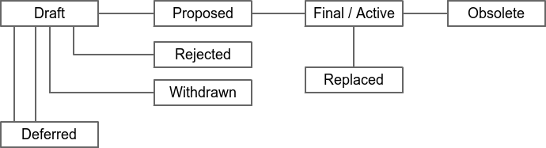

```
TIP: 1
Type: Process
Title: TIP process
Status: Active
Author: Shigeyuki Azuchi <azuchi@chaintope.com>
Created: 2023-07-04
License: CC0
```

## Abstract

TIP stands for Tapyrus Improvement Proposal. A TIP is a design document providing information to the Tapyrus community,
or describing a new feature for Tapyrus or its processes or environment.
The TIP should provide a concise technical specification of the feature and a rationale for the feature.

We intend TIPs to be the primary mechanisms for proposing new features,
for collecting community input on an issue, and for documenting the design decisions that have gone into Tapyrus.
The TIP author is responsible for building consensus within the community and documenting dissenting opinions.

Because the TIPs are maintained as text files in a versioned repository,
their revision history is the historical record of the feature proposal.

## Copyright

This TIP is licensed under the CC0 license.

## TIP workflow

The TIP process begins with a new idea for Tapyrus. Each potential TIP must have a champion --
someone who writes the TIP using the style and format described below,
shepherds the discussions in the appropriate forums, and attempts to build community consensus around the idea.
The TIP champion (a.k.a. Author) should first attempt to ascertain whether the idea is TIP-able.
Small enhancements or patches to a particular piece of software often don't require standardisation
between multiple projects; these don't need a TIP and should be injected into the relevant project-specific development
workflow with a patch submission to the applicable issue tracker.
Additionally, many ideas have been brought forward for changing Tapyrus that have been rejected for various reasons.
The first step should be to search past discussions in this repository to see if an idea has been considered before,
and if so, what issues arose in its progression. 

### TIP editors

The current TIP editors are:

* Shigeyuki Azuchi([azuchi@chaintope.com](<mailto:azuchi@chaintope.com>))

### TIP Editor Responsibilities & Workflow

For each new TIP submission, the editors do the following:

* Read the TIP to check if it is ready: sound and complete. The ideas must make technical sense, even if they don't seem likely to get to final status.
* The title should accurately describe the content.
* Motivation and backward compatibility (when applicable) must be addressed.
* Licensing terms must be acceptable for TIPs.

If the TIP isn't ready, the editor will send it back to the author for revision, with specific instructions.
Once the TIP is ready for the repository it should be submitted as a "pull request" to the TIPs git repository where it may get further feedback.

The TIP editor will:

* Assign a TIP number in the pull request.
* Merge the pull request when it is ready.
* List the TIP in README.mediawiki
* The TIP editors are intended to fulfill administrative and editorial responsibilities. The TIP editors monitor TIP changes, and update TIP headers as appropriate.

## TIP format and structure

### Specification

TIPs should be written in markdown format.

Each TIP should have the following parts:

Each TIP should have the following parts:

* Preamble -- Headers containing metadata about the TIP ([see below]()).
* Abstract -- A short (~200 word) description of the technical issue being addressed.
* Copyright -- The TIP must be explicitly licensed under acceptable copyright terms ([see below]()).
* Specification -- The technical specification should describe the syntax and semantics of any new feature. The specification should be detailed enough to allow competing, interoperable implementations for any of the current Tapyrus platforms.
* Motivation -- The motivation is critical for TIPs that want to change the Tapyrus protocol. It should clearly explain why the existing protocol is inadequate to address the problem that the TIP solves.
* Rationale -- The rationale fleshes out the specification by describing what motivated the design and why particular design decisions were made. It should describe alternate designs that were considered and related work. The rationale should provide evidence of consensus within the community and discuss important objections or concerns raised during discussion.
* Backwards compatibility -- All TIPs that introduce backwards incompatibilities must include a section describing these incompatibilities and their severity. The TIP must explain how the author proposes to deal with these incompatibilities.
* Reference implementation -- The reference implementation must be completed before any TIP is given status "Final", but it need not be completed before the TIP is accepted. It is better to finish the specification and rationale first and reach consensus on it before writing code. The final implementation must include test code and documentation appropriate for the Tapyrus protocol.

### TIP header preamble

Each TIP must begin with an RFC 822 style header preamble. The headers must appear in the following order.
Headers marked with "*" are optional and are described below. All other headers are required.

```
  TIP: <TIP number, or "?" before being assigned>
* Layer: <Consensus (soft fork) | Consensus (hard fork) | Peer Services | API/RPC | Applications>
  Title: <TIP title; maximum 44 characters>
  Author: <list of authors' real names and email addrs>
* Discussions-To: <URL>
* Comments-Summary: <summary tone>
  Comments-URI: <links to wiki page for comments>
  Status: <Draft | Active | Proposed | Deferred | Rejected |
           Withdrawn | Final | Replaced | Obsolete>
  Type: <Standards Track | Informational | Process>
  Created: <date created on, in ISO 8601 (yyyy-mm-dd) format>
  License: <abbreviation for approved license(s)>
* License-Code: <abbreviation for code under different approved license(s)>
* Requires: <TIP number(s)>
* Replaces: <TIP number>
* Superseded-By: <TIP number>
```

The Layer header (only for Standards Track TIPs) documents which layer of Tapyrus the TIP applies to.

The Author header lists the names and email addresses of all the authors/owners of the TIP.
The format of the Author header value must be

    Shigeyuki Azuchi <azuchi@chaintope.com>

If there are multiple authors, each should be on a separate line following RFC 2822 continuation line conventions.

While a TIP is in private discussions (usually during the initial Draft phase), a Discussions-To header will indicate the URL where the TIP is being discussed. No Discussions-To header is necessary if the TIP is being discussed privately with the author, or on this repository.

The Type header specifies the type of TIP: Standards Track, Informational, or Process.

TIPs may have a Requires header, indicating the TIP numbers that this TIP depends on.

TIPs may also have a Superseded-By header indicating that a TIP has been rendered obsolete by a later document; the value is the number of the TIP that replaces the current document. The newer TIP must have a Replaces header containing the number of the TIP that it rendered obsolete.

### Auxiliary Files

TIPs may include auxiliary files such as diagrams. Auxiliary files should be included in a subdirectory for that TIP,
or must be named TIP-XXXX-Y.ext, where "XXXX" is the TIP number, "Y" is a serial number (starting at 1),
and "ext" is replaced by the actual file extension (e.g. "png").

## TIP types

There are three kinds of TIP:

* A Standards Track TIP describes any change that affects most or all Tapyrus implementations, such as a change to the network protocol, a change in block or transaction validity rules, or any change or addition that affects the interoperability of applications using Tapyrus. Standards Track TIPs consist of two parts, a design document and a reference implementation.
* An Informational TIP describes a Tapyrus design issue, or provides general guidelines or information to the Tapyrus community, but does not propose a new feature. Informational TIPs do not necessarily represent a Tapyrus community consensus or recommendation, so users and implementors are free to ignore Informational TIPs or follow their advice.
* A Process TIP describes a process surrounding Tapyrus, or proposes a change to (or an event in) a process. Process TIPs are like Standards Track TIPs but apply to areas other than the Tapyrus protocol itself. They may propose an implementation, but not to Tapyrus's codebase; they often require community consensus; unlike Informational TIPs, they are more than recommendations, and users are typically not free to ignore them. Examples include procedures, guidelines, changes to the decision-making process, and changes to the tools or environment used in Tapyrus development. Any meta-TIP is also considered a Process TIP.

## TIP status field

The typical paths of the status of TIPs are as follows:



* **Draft** - The first formally tracked stage of a TIP in development. A TIP is merged by a TIP Editor.
* **Deferred** - The TIP editor may also change the status to Deferred when no progress is being made on the TIP.
* **Withdrawn** - Champions of a TIP may decide on their own to change the status between Draft, Deferred, or Withdrawn.
* **Rejected** - TIPs should be changed from Draft status to Rejected status, upon request by any person,
  if they have not made progress in three years. Such a TIP may be changed to Draft status if the champion provides
  revisions that meaningfully address public criticism of the proposal,
  or to Proposed status if it meets the criteria required as described in the previous paragraph.
* **Proposed** - a TIP may only change status from Draft (or Rejected) to Proposed, when the author deems it is complete,
  has a working implementation (where applicable), and has community plans to progress it to the Final status.
* **Final / Active** - a Proposed TIP may progress to Final only when specific criteria reflecting real-world adoption
  has occurred. This is different for each TIP depending on the nature of its proposed changes,
  which will be expanded on below. Evaluation of this status change should be objectively verifiable,
  and/or be discussed on this repository. A TIP may change status from Draft to Active when it achieves rough consensus.
  Such a proposal is said to have rough consensus if it has been open to discussion on this repository
  for at least one month, and no person maintains any unaddressed substantiated objections to it.
  Addressed or obstructive objections may be ignored/overruled by general agreement that they have
  been sufficiently addressed, but clear reasoning must be given in such circumstances.
* **Replaced or Obsolete** - when a Final TIP is no longer relevant, its status may be changed to
  Replaced or Obsolete (which is equivalent to Replaced). This change must also be objectively
  verifiable and/or discussed.

## Rationale

TIPs will serve as the primary mechanism for proposing new features for the Tapyrus protocol, documenting their design,
and avoiding collisions of scarce identifiers (as some proposals may request one or more).
Hopefully, they will provide an avenue for developers to quickly get feedback on their ideas.
Because the TIPs are maintained as text files in a versioned repository,
their revision history is the historical record of the feature proposal.

It is highly recommended that a single TIP contain a single key proposal or new idea.
More focused TIPs will tend to be more successful. If in doubt, a TIP should be split into several well-focused ones.

For developers, TIPs are a convenient way to track the progress of their implementation.
Ideally, each implementation editor would list the TIPs they have implemented.
This will give end users a convenient way to know the current status of a given implementation or library.
