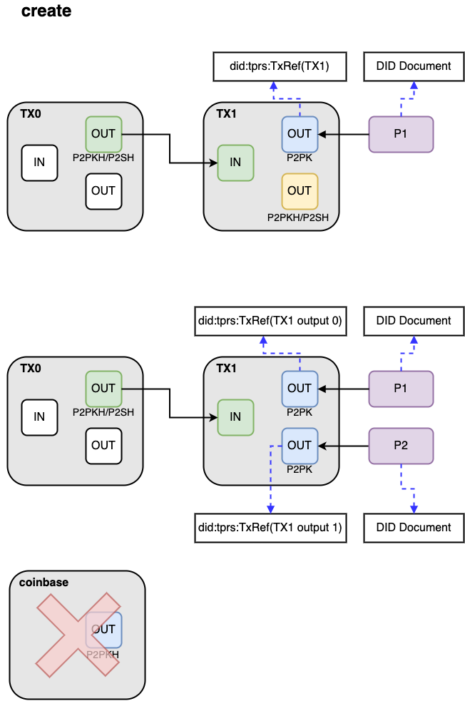
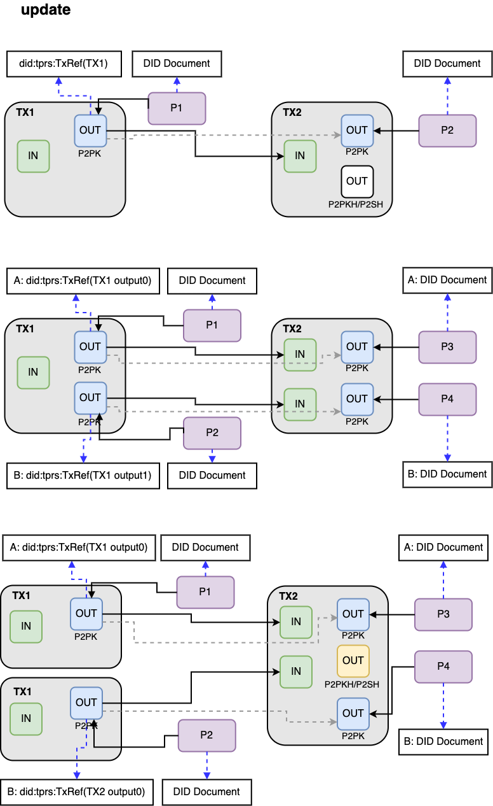
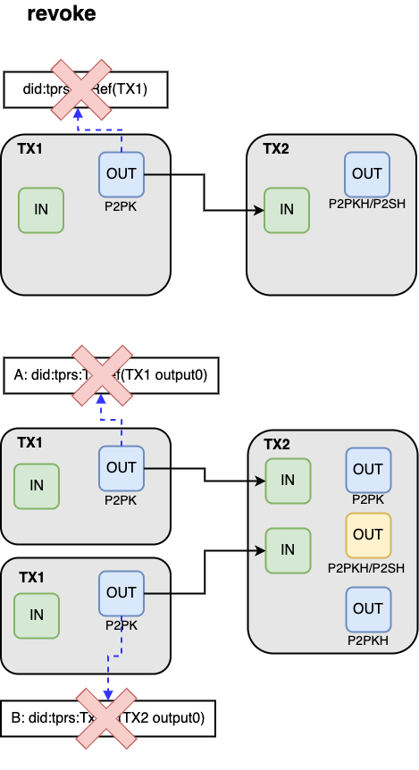

```
TIP: xxxx
Type: Application
Title: Tapyrus DID Methods
Status: Draft
Author: Yukishige Nakajo <nakajo@chaintope.com>
Created: 2023-07-20
License: CC0
```

## Abstract

This document describes the did numbering method for using Tapyrus as a Verifiable Data Registry.

## Motivation
If Tapyrus can issue IDs that comply with the [DID specifications](https://www.w3.org/TR/did-core/) formulated by the W3C Credentials Community Group, it will be possible to apply Tapyrus to various applications that use Verifiable Credentials and other distributed IDs, for example.

Also, it is often used by mapping the Tapyrus address to a certain Entity. For example, when using address as the company's ID. In this case, DID Document can be obtained by expressing Tapyrus address as DID instead of using address directly. This makes the ID verifiable and allows Tapyrus addresses to be conveniently mapped for various uses.

## Specification

### 1. Introduction
Tapyrus DID Method(`did:tprs`) expresses DID using Tapyrus Blockchain. As a result, in various services provided for enterprises, it becomes possible to assign a unique ID to the target person of the service.

The second purpose of `did:tprs` is to allow IDs to be given to arbitrary subjects. This makes it possible to assign unique IDs to things that do not have personalities, such as so-called NFTs, arbitrary documents, and image data, and make them targets of Verifiable Credentials.

Basically, it follows the specification of `did:btcr`, but some items extended by Tapyrus are modified as appropriate. This specification defines the modified items without omission, and also redefines the unmodified parts from the `did:btcr` item.

`did:tprs` is expressed using the TxRef format. This restriction imposes some inconvenience that the DID must be recorded on-chain, but the trade-off is that the DID is guaranteed to exist.

### 2. Terminology

TBD

### 3. Basic Concepts

#### 3.1. TxRef

**TxRef Piece**

Like `did:btcr`, `did:tprs` constructs identifiers using [BIP-0136, Bech32 Encoded Transaction Position References.](https://github.com/bitcoin/bips/blob/master/bip-0136.mediawiki) encoding.

However, in Tapyrus there are multiple networks, and they are identified by their Network ID, which extends the target parameter of TxRef. Shown in Table 3-1 below.

Reserved Bit is for adjusting the bit column after Version to be the same as `did:btcr`. Future use should be fully considered.

Also, while [BIP-0136](https://github.com/bitcoin/bips/blob/master/bip-0136.mediawiki) refers to tx input, this specification refers to tx output.

* Table 3-1. Parameters for TxRef

| | description                            | possible type | # ob Bits used | values                                           |
|----|----------------------------------------|----|----|--------------------------------------------------| 
| Network ID | Identifier of Tapyrus Network          | Uint32 | 32 | 0 to 4294967295 <br/> ex)Tapyrus API Network = 1 |
| Reserved Bit | for adjusting bits                     | Uint8 | 3 | only 0                                           |
| Version | future use                             | Uint8 | 1 | only 0                                           |
| Block Height | The Block Height including Tx          | Uint32 | 24 | Block 0 to Block 16777215                        |
| Transaction Index | Position in block of Tx containing DID | Uint16 | 15 | Tx 0 to Tx 32767                                 |
| Output Index | Position of Tx output as DID           | Uint16 | 15 | Tx 0 to Tx 32767                                 |


**Encoding Table**

Convert 5bit data to a string using the same encoding table as Bech32m in [BIP-0350](https://github.com/bitcoin/bips/blob/master/bip-0350.mediawiki). The 32 characters to be mapped are as follows.

Table 3-2. Conversion Table to String

| |0|1|2|3|4|5|6|7|
|---|---|---|---|---|---|---|---|---|
|+0|q|p|z|r|y|9|x|8|
|+8|g|f|2|t|v|d|w|0|
|+16|s|3|j|n|5|4|k|h|
|+24|c|e|6|m|u|a|7|l|


**Encoding Algorism**

Shows the algorithm for converting the pieces shown in Table 3-1 to TxRef strings.

First, generate an array of 5bit numbers in the following order.

1. Cut out 35bits of Network ID + Reserved Bit by lower 5bits
2. Cut out 25bits of Block Height + Version by lower 5bits
3. Cut out the lower 5 bits of the 15 bits of the Transaction Index
4. If Output Index is not 0, cut out 15bit by lower 5bit

Finally, after calculating the checksum of the above 5-bit numeric array, convert each value to char according to the character table in Table 3-2.

A sample code is shown in List 3-1 below.

* List3-1. Sample code for generating an array of 5bit numbers

```python
def to_uint5_array(val, length):
   res = []
   for i in range(0, length):
      res.append(val & 0x1f)
   val = val >> 5
   return res

def bech32_encoding(network_id, block_height, tx_index, out_index):
   res = []
   res += to_uint5_array(network_id << 3, 7)
   res += to_uint5_array(block_height << 1, 5)
   res += to_uint5_array(tx_index, 3)
   if out_index > 0:
     res += to_uint5_array(out_index, 3)
   return res
```

**Encoding Examples**

An example of TxRef for Network ID #1, Transaction Index #1234, Block Height #456789, Output Index #0 is shown below.

| | Decimal Value | Binary Value                                        | # of Bits Used | Bit Index and Value                                                                                                                                                                                                                                                                                                                                                           |
|---|---|-----------------------------------------------------|----------------|-------------------------------------------------------------------------------------------------------------------------------------------------------------------------------------------------------------------------------------------------------------------------------------------------------------------------------------------------------------------------------|
| Network ID | 1 | 00000000<br/>00000000<br/>00000000<br/>00000001<br/> | 32             | (ni31, ni30, ni29, ni28, ni27) = (0, 0, 0, 0, 0)<br/>(ni26, ni25, ni24, ni23, ni22) = (0, 0, 0, 0, 0)<br/>(ni21, ni20, ni19, ni18, ni17) = (0, 0, 0, 0, 0)<br/>(ni16, ni15, ni14, ni13, ni12) = (0, 0, 0, 0, 0)<br/>(ni11, ni10, ni09, ni08, ni07) = (0, 0, 0, 0, 0)<br/>(ni06, ni05, ni04, ni03, ni02) = (0, 0, 0, 0, 0)<br/>(ni01, ni00)                           = (0, 1) |
| Reserved Bit | 0 | 00000000                                            | 3              | (rb02, rb01, rb00) = (0, 0, 0)                                                                                                                                                                                                                                                                                                                                                |
| Version | 0 | 00000000                                            | 1              | (vr00) = (0)                                                                                                                                                                                                                                                                                                                                                                  |
| Block height | 456789 | 00000110<br/>11111000<br/>01010101<br/>             | 24             | (bh23, bh22, bh21, bh20)           = (0, 0, 0, 0)<br/>(bh19, bh18, bh17, bh16, bh15) = (0, 1, 1, 0, 1)<br/>(bh14, bh13, bh12, bh11, bh10) = (1, 1, 1, 1, 0)<br/>(bh09, bh08, bh07, bh06, bh05) = (0. 0. 0. 1. 0)<br/>(bh04, bh03, bh02, bh01, bh00) = (1, 0, 1, 0, 1)<br/>                                                                                                    |
| Transaction index | 1234 | 00000100<br/>11010010                               | 15             | (ti14, ti13, ti12, ti11, ti10) = (0, 0, 0, 0, 1)<br/>(ti09, ti08, ti07, ti06, ti05) = (0, 0, 1, 1, 0)<br/>(ti04, ti03, ti02, ti01, ti00) = (1, 0, 0, 1, 0)<br/>                                                                                                                                                                                                               |
| Output index | 0 | omit                                                | omit           | omit                                                                                                                                                                                                                                                                                                                                                                          |

| | ni01 | ni00 | rb02 | rb01 | rb00 | decimal value | encoding char |
|---|---|---|---|---|---|---|---|
| data[0] | 0 | 1 | 0 | 0 | 0 | 8 | g |

| | ni06 | ni05 | ni04 | ni03 | ni02 | decimal value | encoding char |
|---|---|---|---|---|---|---|---|
| data[1] | 0 | 0 | 0 | 0 | 0 | 0 | q |

|  | ni11 | ni10 | ni09 | ni08 | ni07 | decimal value | encoding char |
|---|---|---|---|---|---|---|---|
| data[2] |0 | 0 | 0 | 0 | 0 | 0 | **q** |

| | ni16 | ni15 | ni14 | ni13 | ni12 | decimal value | encoding char
|---|---|---|---|---|---|---|---|
| data[3] | 0 | 0 | 0 | 0 | 0 | 0 | **q** |

| | ni21 | ni20 | ni19 | ni18 | ni17 | decimal value | encoding char
|---|---|---|---|---|---|---|---|
| data[4] | 0 | 0 | 0 | 0 | 0 | 0 | **q** |

| | ni26 | ni25 | ni24 | ni23 | ni22 | decimal value | encoding char
|---|---|---|---|---|---|---|---|
| data[5] | 0 | 0 | 0 | 0 | 0 | 0 | **q** |

| | ni31 | ni30 | ni29 | ni28 | ni27 | decimal value | encoding char
|---|---|---|---|---|---|---|---|
| data[6] | 0 | 0 | 0 | 0 | 0 | 0 | **q** |

| | bh03 | bh02 | bh01 | bh00 | vr00 | decimal value | encoding char
|---|---|---|---|---|---|---|---|
| data[7] | 0 | 1 | 0 | 1 | 0 | 10 | **2** |

|  | bh08 | bh07 | bh06 | bh05 | bh04 | decimal value | encoding char
|---|---|---|---|---|---|---|---|
| data[8] | 0 | 0 | 1 | 0 | 1 | 5 | **9** |

| | bh13 | bh12 | bh11 | bh10 | bh09 | decimal value | encoding char
|---|---|---|---|---|---|---|---|
| data[9] | 1 | 1 | 1 | 0 | 0 | 28 | **u** |

| | bh18 | bh17 | bh16 | bh15 | bh14 | decimal value | encoding char
|---|---|---|---|---|---|---|---|
| data[10] | 1 | 1 | 0 | 1 | 1 | 27 | **m** |

| | bh23 | bh22 | bh21 | bh20 | bh19 | decimal value | encoding char
|---|---|---|---|---|---|---|---|
| data[11] | 0 | 0 | 0 | 0 | 0 | 0 | **q** |

| | ti04 | ti03 | ti02 | ti01 | ti00 | decimal value | encoding char
|---|---|---|---|---|---|---|---|
| data[12] | 1 | 0 | 0 | 1 | 0 | 18 | **j** |

| | ti09 | ti08 | ti07 | ti06 | ti05 | decimal value | encoding char
|---|---|---|---|---|---|---|---|
| data[13] | 0 | 0 | 1 | 1 | 0 | 6 | **x** |

| | ti14 | ti13 | ti12 | ti11 | ti10 | decimal value | encoding char
|---|---|---|---|---|---|---|---|
| data[14] | 0 | 0 | 0 | 0 | 1 | 1 | **p** |

After conversion, it becomes the following string representation.

| | 0 | 1 | 2 | 3 | 4 | 5 | 6 | 7 | 8 | 9 | 10 | 11 | 12 | 13 | 14 |
|---|---|---|---|---|---|---|---|---|---|---|---|---|---|---|---|
| decimal | 8 | 0 | 0 | 0 | 0 | 0 | 0 | 10 | 5 | 28 | 27 | 0 | 18 | 6 | 1 |
| char | g | q | q | q | q | q | q | 2 | 9 | u | m | q | j | x | p |

**Checksum**

Finally, [BIP-0350](https://github.com/bitcoin/bips/blob/master/bip-0350.mediawiki), Bech32m format checksum is given. The following 6 characters are obtained as Checksum.
check_sum=['p', 'k', '2', 'f', 'u', 'x']

The final TxRef will be the following string:

```
gqqqqqq29umqjxppk2fux
```

**Prefix Exclusion**

As with `did:btcr`, `did:tprs` also excludes Prefix defined in [BIP-0173](https://github.com/bitcoin/bips/blob/master/bip-0173.mediawiki).

**Elimination of representation ambiguity when Output Index=0**

As with `did:btcr`, `did:tprs` only uses abbreviations when the Output Index is 0. For example:

* When Network ID=1, Block Height=120739, Transaction Index=10, Output Index=0

```
Example) No Output Index

VALID:
gqqqqqqx6t8q2qqllpff-y

INVALID:
gqqqqqqx6t8q2qqqqqaajauw
```

* When Network ID=1, Block Height=120739, Transaction Index=10, Output Index=2

```
例）With Output Index

gqqqqqqx6t8q2qqzqqeeq68h
```

A DID Resolver MUST reject a DID if it detects an invalid format.

#### 3.2. TPRS DID Format

The format of `did:tprs` is as follows.

```
tprs-did  = "did:tprs:" tprs-identifier
             [ ";" did-service ] [ "/" did-path ]
             [ "?" did-query ] [ "#" did-fragment ]

tprs-identifier = TxRef encoded transaction id
```

Example) When Network ID=1 and txid 67c0ee676221d9e0e08b98a55a8bf8add9cba854f13dda393e38ffa1b982b833 on Tapyrus chain is below. 

```
# Beacuase block height 1201739, transaction position 2, tx output index 1

gqqqqqqkytfzzqqpqqzyj5es
```

#### 3.3. Default Capabilities
For `did:tprs`, the DID resolver needs to generate the DID document from the transaction itself. Specifically, the following functions are given to the public key included in the Unspent Transaction Output.

- authentication
- Sign to Verifiable Credential(assertionMethod)

* Example) DETAILED EXAMPLE OF DEFAULT CAPABILITIES
```
{
  "@context": [
    "https://www.w3.org/ns/did/v1",
    "https://w3id.org/security/suites/jws-2020/v1"
  ],
  "id": "did:tprs:gqqq-qqqx-6t8q-2qql-lpff-y",
  "verificationMethod": [
    {
      "id": "did:tprs:gqqq-qqqx-6t8q-2qql-lpff-y#HR6tZUxowdmr7F7eSh6Qr3zfpoGczZanJQn6Nu_QiFM",
      "type": "EcdsaSecp256k1VerificationKey2019",
      "controller": "did:tprs:gqqq-qqqx-6t8q-2qql-lpff-y",
      "publicKeyJwk": {
        "kty": "EC",
        "crv": "secp256k1",
        "x": "NQJZqt9UgxBW0VCPIrR_hDZH-uh0z-HzBbOwxIC3ZOY",
        "y": "IgiHuaCq184PNRESJAB408p7MFgu4R7C0Kf80fcOjFQ",
        "kid": "HR6tZUxowdmr7F7eSh6Qr3zfpoGczZanJQn6Nu_QiFM"
      }
    }
  ],
  "authentication": ["did:tprs:gqqq-qqqx-6t8q-2qql-lpff-y#HR6tZUxowdmr7F7eSh6Qr3zfpoGczZanJQn6Nu_QiFM"],
  "assertionMethod": ["did:tprs:gqqq-qqqx-6t8q-2qql-lpff-y#HR6tZUxowdmr7F7eSh6Qr3zfpoGczZanJQn6Nu_QiFM"]
}
```

Like `did:btcr`, `did:tprs` will generate a document if it transaction is UTXO. If the TPRS DID's transaction is spent (SPENT), we need to follow the transaction chain and look for an unused tip tx.

#### 3.4. Continuation DID Documents

`did:tprs` does not have the DDO (DID Descriptor Object) defined by `did:btcr`. `did:tprs` generates a DID Document from transactions only. This specification was adopted considering the following points.

- Writing a URL in OP_RETURN leads to an increase in block capacity.
- The existence of the DID Document at the URL destination introduces the risk of tampering, and the advantage of registering the DID with Tapyrus is lost.

Since `did:tprs` assumes a wider range of users, it is designed with a focus on security risks.

### 4. Operations

#### 4.1. Creating a DID

`did:tprs` is generated by creating and broadcasting a Tapyrus transaction according to the specifications described in this section. Tx output with P2PK(Pay-to-PublicKey) contract is available as `did:tprs`.

**abbreviation:**
- TXi = Tapyrus transaction i
- Pi = public key i
- Si = private key i

**Creating the first `did:tprs`:**
1. Decide TX0 to use as tx input
2. Create key P1/S1
3. Create a Tapyrus transaction TX1 with the following 4. and 5.
4. tx input => any output of TX0
5. tx output => P2PK for payments to P1
6. TX1's P2PK reveals the public key
7. Broadcast TX1 and wait for Block confirmation
8. Encode it to TxRef that the output with P2PK in confirmed transaction TX1.

Once the above is done, you will have a DID of the form did:tprs:TxRef(TX1).

It is possible to create multiple `did:tprs` with one tx by having multiple P2PK outputs.

coinbase TX output is not `did:tprs`.



#### 4.2. Reading a DID

1. Extract TxRef (TxRef(TX1) part of did:tprs:TxRef(TX1)) from `did:tprs`.
2. Search for transactions.
3. Check if output is UTXO.

**YES**: Is a valid DID. A resolver MUST generate and return a DID Document. (see 3.3)

**NO**: Find tip tx that is both P2PK and UTXO. After that, generate and return the public key of tip tx as a DID Document. If the P2PK UTXO is not found, treat the DID as revoked.

#### 4.3. Updating a DID

It is assumed that did for key P1 has already been issued. Let TX1 be the transaction of that did.

1. Create new key P2/S2
2. Create a Tapyrus transaction TX2 with the following 3. and 4.
3. tx input => output specified by `did:tprs` of TX1
4. tx output => P2PK for payments to P2
5. TX2's P2PK reveals the public key
6. Broadcast TX2 and wait for Block confirmation

It is also possible to update multiple `did:tprs` with one tx. However, the number of P2PKs referred to by input and the number of P2PKs existing in output MUST be the same.Otherwise, all `did:tprs` referred to by input are revoked.



#### 4.4. Revoke a DID

It is assumed that did for key P1 has already been issued. Let TX1 be the transaction of that did.

1. Create new key P2/S2
2. Create TX2 including 3. 4. below
3. tx input => output specified by `did:tprs` of TX1
4. tx output => other than P2PK
5. Broadcast TX2 and wait for Block confirmation

If there is no P2PK on the output of the tip tx, the `did:tprs` paid as the input of that tx will be revoked.

Also, if the number of P2PKs referenced by the tx input is not the same as the number of P2PKs present in the output, all `did:txrs` referenced by the tx input will be revoked.
This is true even if the number of outputs with P2PK is greater than the number of inputs.

A Tapyrus transaction always expresses only one of DID issuance, update, and revocation.

A single transaction cannot perform multiple operations such as issue, update, and revoke.


